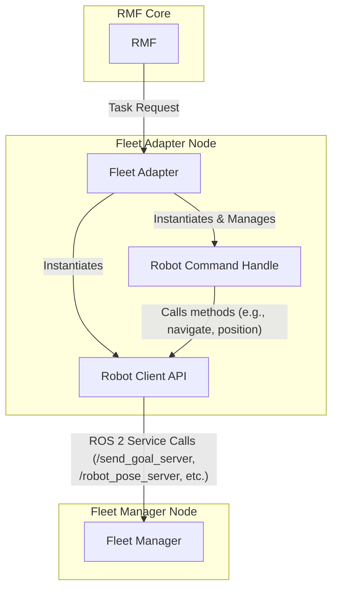
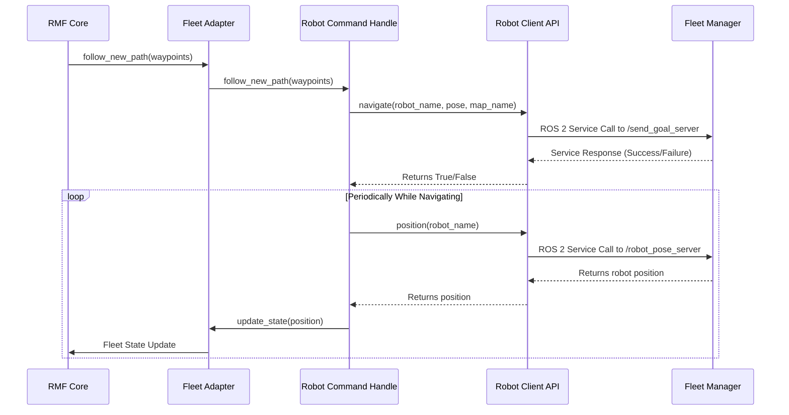

# eta Fleet Adapter

## Configuration

The Fleet Adapter is configured using the `config.yaml` file. This file contains the following main sections:

*   `rmf_fleet`: This section defines the parameters for the RMF fleet, such as the fleet name, robot limits, and battery system information.
*   `robots`: This section contains the configuration for each robot in the fleet. Each robot has a unique name (e.g., `eta1`) and its own set of parameters, including:
    *   `robot_config`: Robot-specific configurations, such as the maximum allowed delay.
    *   `rmf_config`: RMF-specific configurations, such as the robot's starting position and charger waypoint.
*   `reference_coordinates`: This section is used for computing transforms between RMF and the robot coordinate systems. This parameter is defined with two matrices, one with the values of several points in the RMF system and the other one with the values of the same points in the robot system. 
    * For this project, the values used were the spawning points of the 4 eta robots. The values on the RMF coordinates were obtained through the use of the [Traffic Editor](https://osrf.github.io/ros2multirobotbook/traffic-editor.html) tool. The values on the robot coordinates are taken from the spawning position of the robots on the nav2 frame.

## Inputs

The Fleet Adapter receives the following inputs:

*   **RMF Commands**: The Fleet Adapter receives high-level commands from RMF, such as:
    *   `follow_new_path`: To instruct a robot to follow a new path.
    *   `dock`: To instruct a robot to dock at a specific location.
*   **Navigation Graph**: The Fleet Adapter requires a navigation graph file, which defines the waypoints and lanes that the robots can use for navigation.

## Outputs

The Fleet Adapter produces the following outputs:

*   **Robot State Updates**: The Fleet Adapter provides RMF with updates on the state of the robots, including their position, battery level, and current status.
*   **Commands to Fleet Manager**: The Fleet Adapter sends commands to the Fleet Manager using the following ROS 2 services:
    *   `/send_goal_server`: To send a navigation goal to a robot.
    *   `/cancel_goal_server`: To cancel a robot's current goal.
    *   `/robot_pose_server`: To request the position of a robot.

## Architecture

The eta Fleet Adapter is composed of three main Python objects that work together to integrate the robot fleet with RMF.

### Fleet Adapter ([fleet_adapter.py](eta_fleet_adapter/fleet_adapter.py))

The Fleet Adapter is the central component that connects the robot fleet to the Robotics Middleware Framework (RMF). Its primary responsibilities are:

*   **Initialization**: It reads the main [config.yaml](config.yaml) file to get all the necessary configurations for the fleet and the individual robots.
*   **RMF Integration**: It establishes the fleet's presence within RMF, defining its properties like vehicle traits (speed, size), battery system, and capabilities (e.g., performing loops, deliveries, or cleaning tasks).
*   **Robot Representation**: It creates and manages a `RobotCommandHandle` instance for each robot in the fleet.
*   **API Abstraction**: It initializes the `RobotAPI` object, which provides a standardized way to communicate with the fleet's specific control system.
*   **Coordination**: It acts as the bridge, receiving high-level tasks from RMF and delegating them to the appropriate `RobotCommandHandle`.

In essence, the Fleet Adapter is the main orchestrator that brings all the pieces together to make the fleet operational within an RMF environment.

### Robot Client API ([RobotClientAPI.py](eta_fleet_adapter/RobotClientAPI.py))

This class acts as a wrapper for the proprietary API of the robot fleet. Its purpose is to abstract the low-level details of how to communicate with the robots.

*   **Communication Layer**: It implements the specific protocol used to send commands and receive data from the robots' control system. In this project, it uses ROS 2 services (like `/send_goal_server`, `/cancel_goal_server`, and `/robot_pose_server`) to communicate with a separate "Fleet Manager" node.
*   **Standardized Functions**: It provides a clear set of functions that the `RobotCommandHandle` can use without needing to know the underlying communication details. These include methods like:
    *   `position()`: To get the robot's current location.
    *   `navigate()`: To send a navigation goal.
    *   `stop()`: To halt the robot.
    *   `battery_soc()`: To get the battery's state of charge.
*   **Customization**: This is the primary file that developers need to modify to integrate a different type of robot fleet, by defining the API calls. On this project, the communication with the fleet manager is done through ROS 2 service calls.

### Robot Command Handle ([RobotCommandHandle.py](eta_fleet_adapter/RobotCommandHandle.py))

This class represents a single robot within the RMF ecosystem. Each robot in the fleet gets its own `RobotCommandHandle` instance.

*   **State Management**: It maintains the state of an individual robot, including its current position, battery level, and operational state (e.g., `IDLE`, `MOVING`, `WAITING`).
*   **Task Execution**: It receives high-level commands from RMF (forwarded by the Fleet Adapter), such as `follow_new_path()` or `dock()`.
*   **Command Translation**: It translates these high-level RMF commands into a sequence of concrete actions. For example, to follow a path, it iterates through waypoints and uses the `RobotAPI` to send individual navigation goals to the robot.
*   **Status Reporting**: It continuously queries the robot's status using the `RobotAPI` and updates RMF with the robot's live position and battery level. This allows RMF's scheduler to make informed decisions.

## Diagrams

### Object Interaction

This diagram shows the relationship between the core components of the fleet adapter and how they communicate.

### Navigation Task Sequence

This diagram illustrates the sequence of calls for a typical navigation task initiated by RMF.

